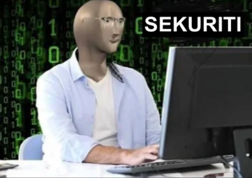

# FCS Labs 2021

50.042 Foundations of Cyber Security Labs 2021

Please do not redistribute the lab materials.

# Contents

| Lab  | Deadline | Materials |
| ---- | -------- | --------- |
| [1A: Shift Cipher](lab1/lab1a_shift_cipher.md) | 22 Sep (2359) | [Download](lab1/lab1.zip) |
| [1B: Linux](lab1/lab1b_linux.md) | N/A | N/A |
| [2: No Brute Force](lab2) | 29 Sep (2359) | [Download](lab2/lab2.zip) |
| [3: MD5, Rainbow Table](lab3) | 6 Oct (2359) | [Download](lab3/lab3.zip) |
| [4: Block Cipher](lab4) | 13 Oct (2359) | [Download](lab4/lab4.zip) |
| [5: Modular Arithmetics](lab5) | 20 Oct (2359) | [Download](lab5/lab5.zip) |
| [6: Diffie-Hellman Key Exchange](lab6) | 27 Oct (2359) | [Download](lab6/lab6.zip) |
| [7: RSA](lab7) | 17 Nov (2359) | [Download](lab7/lab7.zip) |
| CTF | ... | ... |

