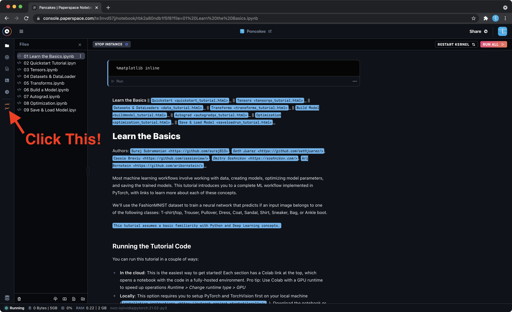
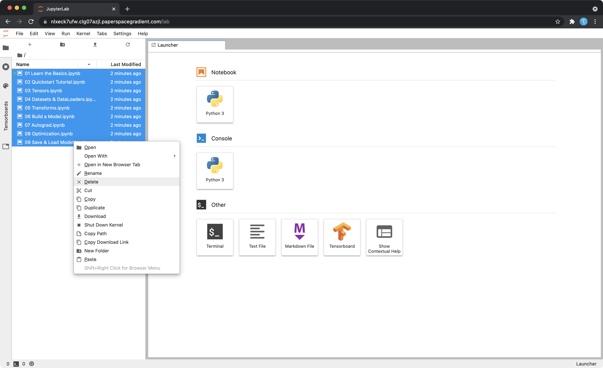
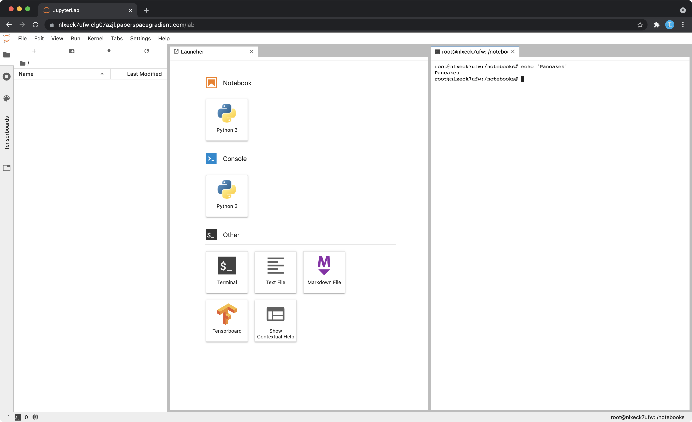

# Lab 1B: Linux

- [Lab 1B: Linux](#lab-1b-linux)
  - [Objectives](#objectives)
  - [Installing Linux](#installing-linux)
    - [About Linux](#about-linux)
    - [VM](#vm)
    - [Dual Boot](#dual-boot)
    - [Alternatives](#alternatives)
      - [General](#general)
      - [For Mac](#for-mac)
  - [Using Linux](#using-linux)
    - [Common Terminal Commands](#common-terminal-commands)
    - [Permissions](#permissions)
      - [File access control in Linux](#file-access-control-in-linux)
      - [`chmod`](#chmod)
      - [`sudo`](#sudo)
  - [Other Useful Resources](#other-useful-resources)
  - [FAQ](#faq)

## Objectives

* Be familiar with using a Linux environment
* Be able to use a Linux environment to do the labs
* This lab is optional and has no submission/grade

## Installing Linux

### About Linux

Linux is a free, open-source operating system that is widely used on many types of computer systems (desktops, servers, smart and embedded devices etc). 90% of all cloud infrastructure on the Internet is powered by Linux. 

Installing Linux is not strictly necessary for this course, but will be a very good learning experience if you have not done it before.

If you don't want to install Linux, you can skip down to the [Alternatives](#alternatives) section for alternatives that you can use during the course.

### VM

This is recommended if you don't want to mess around with your desktop/laptop. 

* Option 1: VMWare Workstation Player (for Windows): [tutorial](https://ubuntu.tutorials24x7.com/blog/how-to-install-ubuntu-on-windows-using-vmware-workstation-player)
* Option 2: Virtualbox (for Windows/Mac): [tutorial](https://itsfoss.com/install-linux-in-virtualbox/)
* Option 3: WSL2 (for Windows): [tutorial]( https://docs.microsoft.com/en-us/windows/wsl/install-win10)
* You might need to enable virtualization in your BIOS settings: Look for Intel: VT-x ; or AMD: SVM or AMD-V

### Dual Boot

This might give you a better desktop experience when using Linux

* [Tutorial](https://www.tecmint.com/install-ubuntu-alongside-with-windows-dual-boot/)
* Suggestion: if you have never done with before, try this as weekend project if you have the time
* FYI: recent MacBooks don't run Linux well - I suggest using a VM instead

### Alternatives

Feel free to use any other alternatives as long as you're comfortable with those. In this section, I provide recommendations only.

#### General

Recommendation: Web-based environment: Paperspace (free!)

1. Register for a PaperSpace account [here](https://console.paperspace.com/signup?gradient=true)
2. After logging in, you should be able to access the [console](https://console.paperspace.com/)
3. Create a new Notebook
   * Name: Whatever you want. I called mine "Pancakes".
   * Runtime: Pick the PyTorch one, although all we need is Linux and Python. But this one seems to load faster.
   * Machine: `Free-CPU`, except for that one lab with hash cracking, you can try `Free-GPU`.
   * Auto-Shutdown: 6h
   * Advanced options: none

You'll be presented with the PaperSpace Gradient interface. Once your machine has started, you'll see something like the image below.

Click the orange icon to launch JupyterLab. (If you don't see it, just wait a while for the machine to finish starting.) After JupyterLab has launched, you will see the following screen. The file browser is on the left side, feel free to right-click and delete all the starter files provided. 

You can press the "+" icon above the file browser to bring up the Launcher, which allows you to create new files and Terminals. The tabbed interface is flexible, and you can drag and rearrange the tabs. You can also create new folders, upload files and refresh the current directory using the other buttons above the file browser.

You can also upload the files (e.g. the files for the lab) by dragging them into the file browser. 

#### For Mac

You should be able to use macOS just fine as long as you have a Python environment configured, and you know how to figure out the macOS port/alternatives to some Linux command line utilities. 

## Using Linux

In Linux, many actions are typically performed using a text-based Terminal, also known as a command line interface. 

From the Linux desktop environment, the Terminal can typically be launched with `Ctrl+Alt+T`. 

Opening the terminal will automatically start a **shell**, and interactive environment. By default, we use `bash`, which supports many features, such as command history navigation (using up/down) keys, and auto-completion of commands, file names, and folder names via the `Tab` key.

### Common Terminal Commands

* Find the usage of commands: `man <command_name>`
* Change the directory: `cd <path_to_new_dir>`
* Listing the contents of a directory: `ls`
* Search files: `locate <filename>`
* Display contents of file: `cat <filename>`
* Print lines matching a pattern: `grep <pattern> <filename>`
* Make a directory: `mkdir <path_to_new_dir>`
* Move a file: `mv <current_path> <new_path>`
* Copy a file: `cp <current_path> <new_path>`
* Copy a directory: `cp -r <current_path> <new_path>`
* Delete a file: `rm <filename>`
* Delete a directory: `rm -r <path>`
* Zip a folder: `zip -r folder.zip folder`
* Unzip a file: `unzip archive.zip`
* Rage quit: `rm -rf / --no-preserve-root`

### Permissions

#### File access control in Linux

Linux uses per-file access control. There are three different types of access to a file: reading (`r`) , writing (`w`), and execution (`x`).

Each file also has three associated "type" of user(s):

* the owner of the file (u)
* users in the file's group (g)
* and the rest of the users (o)

Typically the file owner is a (single) user who created the file, the file's group is used to group other users who may want to access the file, and the other users are the remaining users.

The access rights for *each* of those three classes of users can be described in a short string, e.g. `r-x` for read and execution rights. The rights of all three types of users together yield a longer string, e.g. `rw-r–r–` for a file which can be read and written by the owner, but only read by everyone else.

**Example**

From the terminal, use `ls -l filename` to see the current permission bits state of a file. For example, you can get an output like: `-rw-r--r--`. Ignore the first character and focus on the following three triplets of characters. In our example:

* owner has read and write permissions
* group has read permission
* others user have read permission

You can read the name of the file's owner and file's group from the output of the same command.

Try using `ls` and `cd` to look around on your system, and see who has what kind of access control to which file. The content of `/etc/` could be especially interesting.

#### `chmod`

We can use `chmod`, "change file mode", to change the access control right on files and directories. Note that you have to be either root (Eg: using `sudo`) or the owner of a file to change the file's rights.

There are two ways to set the file's permission bits: symbolic, and
octal, in the following examples we will focus on the symbolic one, where we use `r`, `w`, and `x`.

**Examples**

* `chmod o-w file1`: deny others from writing
* `chmod u+rwx file1`: give owner read, write, execute per-
missions
* `chmod +rwx file1`: give everyone read, write and execute permis-
sions over file1 (probably bad for security!)
* `chmod +x file1`: allow anyone to execute

#### `sudo`

By default your system user (type `whoami` to print it) does not have administrator rights (to modify the system, such as installing applications with `apt`). In Linux, the administrator account is called "superuser" or "root". Your system is set up to allow you to perform commands as root by using `sudo` in front of the command.

## Other Useful Resources

* [What is Linux? from Red Hat](https://www.redhat.com/en/topics/linux/what-is-linux)
* [Linux Cheat Sheet](https://www.guru99.com/linux-commands-cheat-sheet.html)

## FAQ

* Which version of Linux should I install:
  * Pick one of Lubuntu 20.04, Xubuntu 20.04, Ubuntu Mate 20.04 Why? Lubuntu, Xubuntu, Mate all use lightweight desktop environments that run better in a VM. 20.04 is more stable than 21.04. But the choice here doesn't really matter, here are some suggestions.
* VM or Dual boot?
  * If your laptop is your only computer and you need it on a daily basis, I recommend using a VM if you are not already familiar with the process of dual booting. This is to avoid downtime if you do something wrong. You won't break your laptop, you might just need to reinstall Windows if something goes wrong. 
* VMWare Player or Virtualbox?
  * In my experience, Virtualbox is more sluggish. But the choice here doesn't really matter, if you have issues with one, you can go with the other.
* Can I use Gentoo/Arch/Manjaro etc etc?
  * If you know how to ask this question, I think you can answer it by yourself lol
