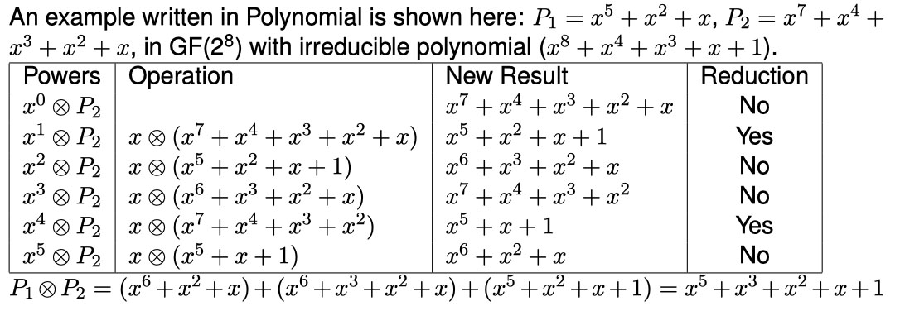
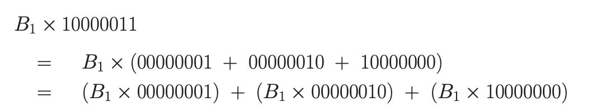
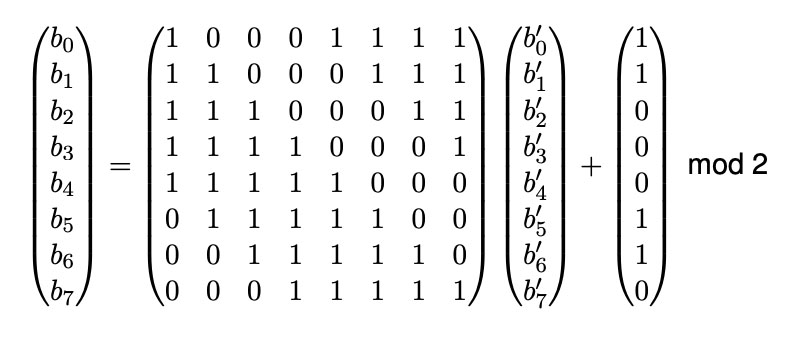
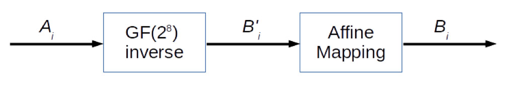

# Lab 5: Modular Arithmetics

**Deadline: 20 Oct (2359)**

- [Lab 5: Modular Arithmetics](#lab-5-modular-arithmetics)
  - [Objectives](#objectives)
  - [Background](#background)
    - [Modular Arithmetic](#modular-arithmetic)
    - [Finite Field](#finite-field)
    - [Irreducible Polynomial](#irreducible-polynomial)
    - [Additional Resources](#additional-resources)
  - [Part I: Algebraic Structures](#part-i-algebraic-structures)
    - [Polynomial2 Methods](#polynomial2-methods)
  - [Part II: Galois Field](#part-ii-galois-field)
  - [Part III: Generate Tables](#part-iii-generate-tables)
  - [Part IV (choose one of two)](#part-iv-choose-one-of-two)
      - [1. Quiz](#1-quiz)
      - [2. AES Byte Substitution Layer](#2-aes-byte-substitution-layer)
  - [Submission](#submission)
    - [eDimension Submission](#edimension-submission)

## Objectives

* Implement a class to do computation in GF(2<sup>n</sup>)
* (optional in Part IV) Implement Byte Substitution layer of AES encryption

You are provided with a file `gf2ntemplate.py` to assist you. Your code will need to pass the test cases at the end of the file.

* **For everyone: Required to pass test cases 1,2,3,4,5,6**
* If you attempt the AES Byte Substitution Layer: test cases 7,8

## Background

### Modular Arithmetic

The following notations refer to the same thing:

* `a = b mod n`
* `a = kn + b`

Where `k` is a quotient and `b` is the remainder of `a` divided by `n`.

The remainder, `b`, is not unique, in fact there are an infinite number of possible remainders. For example:

* `12 =  2 mod 5`
* `12 =  7 mod 5`
* `12 = -3 mod 5`
* and infinitely more

This infinite set of `b`, {..., -8, -3, 2, 7, 12, 17 ... } forms an equivalence class modulo 5.

* all members of this class are "the same", modulo 5
* all have the same "clock representation" = 2 ; try this: [https://www.wolframalpha.com/input/?i=2+mod+5](https://www.wolframalpha.com/input/?i=2+mod+5)
* There are 5 such equivalent classes mod 5: clock representation can be {0,1,2,3,4}.
* All members of an equivalent class are "the same" mod 5. 

An example of "same-ness": say we want to compute `13*16-8`. We can take all the numbers mod 5, which are: 

* `13 = 3 mod 5`
* `16 = 1 mod 5`
* `8  = 3 mod 5`

Which gives us:

```python
# original
13 * 16 - 8 = 200 = 0 mod 5

# replace with mod 5
3  * 1  - 3 = 0   = 0 mod 5
```

Now we can, in theory, perform any computation, mod 5, by using a finite set of 5 elements from the 5 equivalent classes, mod 5. We actually have a finite field GF(5) here, since it does fulfill the properties of a field.

### Finite Field

* A finite field or **Galois field** is a field with a finite order (number of elements).
  * A field is a set of numbers on which addition, subtraction, multiplication, and division/inversion are defined.
* The order of a finite field is always a prime or a power of prime.
* For each prime power q = p<sup>r</sup>, there exists exactly one finite field with q elements.
* This field is denoted GF(q), and the prime field of GF(q) is GF(p).
* A field is called a prime field if it has no proper (i.e., strictly smaller) subfields. Every non-prime field contains a prime field.
* [Classic definition of a field](https://en.wikipedia.org/wiki/Field_(mathematics)#Classic_definition)

### Irreducible Polynomial

* A irreducible polynomial is a polynomial that cannot be factored into the product of two polynomials of positive degree. The opposite is called reducible.
* Irreducible polynomials allow us to construct the finite fields.
* In order to compute some operations in a finite field of non prime order, one needs to generate an irreducible polynomial. Why? Take a look at the earlier mod 5 example for inspiration.
* AES field uses the irreducible polynomial `P(x) = x^8 + x^4 + x^3 + x + 1`

### Additional Resources

* [Galois Fields, Polynomial Algebra and more](https://link.springer.com/content/pdf/bbm%3A978-3-642-54649-5%2F1.pdf)
* [Modular Arithmetic, lecture by Christof Paar](https://www.youtube.com/watch?v=W1SY6qKZrUk&ab_channel=IntroductiontoCryptographybyChristofPaar)
* [Introduction to Galois Fields, lecture by Christof Paar](https://www.youtube.com/watch?v=x1v2tX4_dkQ&ab_channel=IntroductiontoCryptographybyChristofPaar)

## Part I: Algebraic Structures

In this section, you will create a class `Polynomial2` where:

* An instance of the class represents a polynomial, which can be of any arbitrary [degree](https://en.wikipedia.org/wiki/Degree_of_a_polynomial)
* Each coefficient is in [GF(2)](https://en.wikipedia.org/wiki/GF(2)) - i.e. it can either be 0 or 1
* The constructor takes in a list (bit sequence) containing the values of the coefficient of the polynomial **starting from the lowest power to the highest power**

For example, to create x<sup>5</sup> + x<sup>2</sup> + x:

```python
x = Polynomial2([0,1,1,0,0,1])
```

Note:

* At index 0, the value is 0. If the value was 1, we would have a +1 term at the end.
* At index 5, the value is 1, Hence, we have a x<sup>5</sup> term. 
* A list of length 6 (6 bits) is needed to represent a polynomial of degree 5.

(A note on notation: X^N in this document is the same as X<sup>N</sup>)

### Polynomial2 Methods

You will need to implement some methods. Test Cases are provided at the end of the included template script.

**`add()` and `sub()`**

* Write the method `add()` and `sub()` to perform addition and subtraction.
* To do addition, you XOR the coefficient of the same powers. In other words: it us just an XOR of the bit sequences
* Addition and subtraction operations on polynomials are the same operation.
* To understand why, take a look at the [truth tables for GF(2)](https://en.wikipedia.org/wiki/GF(2)#Definition)
* The method should return a new `Polynomial2` object.

```python
p3 = p1.add(p2)
p3 = p1.sub(p2)
```

**Modulus Multiplication with `mul()`**

* Overwrite the method `mul()` to perform modulus multiplication.
* The method takes in another polynomial `p2` to be multiplied and the modulus polynomial `modp` and returns a new `Polynomial2` object.
* The default value for the modulus polynomial is `None`. If `modp`
is given, the multiplication is done with modulus with respect to `modp`. 

```python
p3 = p1.mul(p2, modp)
```

Intuition for modulus multiplication: 

1. Multiply the polynomials just like ordinary polynomials, but remember our coefficients are in GF(2) - multiplication is an AND gate
2. Divide the result by some modulus polynomial and take the remainder

To __compute__ modulus multiplication:

This section describes a method where we first generate the partial results. For example, instead of finding the result of (x<sup>2</sup> ⊗ P2), the program finds the result of (x ⊗ (x ⊗ P2)).

(To better understand this method: see the next section below)

The method to generate partial results is follows:

* If the most significant bit of the previous result is 0, just shift the previous result one bit to the left. This is basically multiplying the polynomial with an x.
* If the most significant bit of the previous result is 1, we need to do the following:
  * 1) shift it one bit to the left, and 
  * 2) XOR it with the modulus, without the most significant bit.
  * This basically means that if we multiplying the polynomial with an x and the result has the same degree as the modulus, we need to reduce the result with the irreducible polynomial or the modulus.

Then, according to the coefficients in the polynomial, add up the partial results to get the final result.

If the multiplication is done without any modulus, simply generate partial results by shifting the previous partial result one bit to the left, then add up the partial results to get the final result.



**Extra notes/breakdown on Modulus Multiplication**

Let’s say you want to multiply a bit patterns, B1 with B2. Each is
8 bits long. We will examine 4 cases of gradually increasing complexity. 

Case 1:

If B2 is the bit pattern 00000001, then obviously nothing needs
to be done. The result is B1 itself. Why? Because B2=1.

Case 2:

If B2 is the bit pattern 00000010, then we are multiplying B1 by
x (since B2=x).

Now the answer depends on the value of the most significant bit (MSB) in B1. 

* If B1 MSB is 0, it is simple. The result is obtained by shifting the B1 bit pattern to the left by one bit and inserting a 0 bit from the right. This is just multiplying a polynomial with x, where the original coeffcient of the max degree (x^7) is 0.
* If your max degree is x^7 (aka B1 MSB is 1), things are a bit different since you have to consider how to handle "multplying out of range". 
* Hence, if B1 MSB is 1, first we again shift the B1 bit pattern to the left. Next, we take the XOR of the shifted pattern with the modulus. This is known as the reduction step. This is intuitively equivalent doing (B1*B2)-ModP. 

Case 3:

If B2 is the bit pattern 00000100, then we are multiplying B1 by x^2 (since B2=x^2).

This amounts to first multiplying B1 by x, and then multiplying the result again by x. So it amounts to two applications of the logic in the previous case. Basically, we perform Case 2 twice. 

Case 4: 

When B2 consists of an arbitrary bit pattern, we consider the bit pattern to be a sum of bit patterns each containing only single bit. This is what "generate partial results" in the previous section on modulus multiplication refers to.



Also see:

* [Another example on multiplication](https://en.wikipedia.org/wiki/Finite_field_arithmetic#Rijndael's_(AES)_finite_field)
* Section 7.8-7.10 in [here](https://engineering.purdue.edu/kak/compsec/NewLectures/Lecture7.pdf)

**Euclidian Division with `div()`**

* Write the method `div()` to perform division.
* Use the Euclidian Division algorithm: [https://en.wikipedia.org/wiki/Polynomial_greatest_common_divisor#Euclidean_division](https://en.wikipedia.org/wiki/Polynomial_greatest_common_divisor#Euclidean_division).
* The method should return two polynomials, one for the quotient and the other for the remainder.

```python
p_qnt, p_rmd = p1.div(p2)
```

In the Euclidian Division algorithm, `deg()` stands for the degree of its argument, and `lc()` stands for the leading coefficient, or the coefficient of the highest degree of the variable.

```python
# Euclidean division
# Input: a and nonzero b (two polynomials in the variable x);
# Output: q, the quotient and r, the remainder;
# begin
q:=0; r:=a;
d:=deg(b); # degree of b
c:=lc(b);  # c = lead coef of b
# remainder is initially a
# quotient is intiially 0
while deg(r) >= d do
  # compute s, where s*b is within remainder
  # set coef of x to: lead coeff of remainder / c
  # set power of x to: deg of remainder - deg of b
  s:=(lc(r)/c)x^{deg(r)-d};
  # add result (s) to quotient
  q:=q+s;
  # minus s*b from remainder
  # "remove the already divided part"
  r:=r-sb;
end do;
return (q, r);
# end
```

**Other Methods**

* Overwrite the `__str__()` method so that it can print the polynomial. For example: `x^5+x^3+x^1+x^0`.
* Write a method `getInt()` that returns the equivalent integer value of the polynomial represented.

## Part II: Galois Field

* Create a class with the name `GF2N` that implements Galois Field.
* An instance of this class belongs to a finite field with the number of element equals to 2<sup>n</sup>.
* The constructor takes in `x`, `n`, and `ip`:
  * `x` is the number to be represented in Galois Field
  * `n` is the power, as in 2<sup>n</sup>
  * `ip` is the irreducible polynomial.
  * The default for `n` is 8.
  * The constructor stores the number as a `Polynomial2` of degree `n-1`.
  * The default irreducible polynomial is: `P(x) = x^8 + x^4 + x^3 + x + 1`. This is also the irreducible polynomial in AES.

You will need to implement some methods. Test Cases are provided at the end of the included template script.

* Implement methods to do addition, subtraction, multiplication, and division.
* Implement a method `getPolynomial2()` that returns the polynomial representation of the number.
* Implement a method `getInt()` that returns the integer value
* Overwrite `__str__()` method so that it can print the integer value.

## Part III: Generate Tables

Create a table for addition and multiplication for GF(2<sup>4</sup>), using (x<sup>4</sup> + x<sup>3</sup> + 1) as the modulus.

Save the table as a text file (`table1.txt`), you will need to submit it.

Your own self-objective (no submission): You should be able to show the workings of addition and multiplication of GF(2n
) by hand.

## Part IV (choose one of two)

In this section, you will choose **one** of the following to attempt:

1. A short True/False quiz (individual work)
2. Implement AES Byte Substitution Layer

#### 1. Quiz

Answer True/False to each of the following questions. **Give a short justification (1-2 sentence) of your answer.**

1. There is no difference between addition and subtraction operation for all elements of GF(3).
2. There is no difference between addition and subtraction operation for all elements of GF(2<sup>N</sup>), for any integer N.
3. For all elements of GF(2), multiplication is equivalent to an AND gate.
4. A polynomial of degree 8 is a possible element of the field GF(2^8).
5. P(x) = x^4 + x^3 + x + 1 is a irreducible polynomial.

Save your answers as `quiz.txt`.

#### 2. AES Byte Substitution Layer

* Inversion in GF(2^8) is the core operation of the Byte Substituion transformation which contains the AES S-Boxes. In this exercise, you need to implement multiplicative inverse as a method in `GF2N` class using the Extended Euclidean Algorithm.
* [https://en.wikipedia.org/wiki/Extended_Euclidean_algorithm](https://en.wikipedia.org/wiki/Extended_Euclidean_algorithm)

**Extended Euclidean Algorithm**

The algorithm can be written as follows. Assume that the Polynomial we want to find the inverse is `b` and the modulus polynomial is `n`.

```python
r1 <- n; r2 <- b;
t1 <- 0; t2 <- 1;
while (r2 > 0)
{
  q <- r1/r2;
  r <- r1 - q x r2;
  r1 <- r2; r2 <- r;
  t <- t1 - q x t2;
  t1 <- t2; t2 <- t;
}
if (r1 = 1) then return t1;
```

**Affine mapping method**

* Implement affine mapping `affineMap()` method in GF2N class.
* Affine mapping is described as the following transformation:



**Byte Substitution layer of AES S-box**

Implement Byte Substitution layer of AES S-box as follows:

* S(A<sub>i</sub>) = B<sub>i</sub>
* B<sub>i</sub> is the output of `affineMap(Bi_prime)`
* `Bi_prime` is the output of `Ai.mulInv()`
* `Ai` is in GF(2<sup>8</sup>)



**Generate Table**

Generate Table 4.3 on page 101 of Understanding Cryptography.

Save the table as a text file (`table2.txt`), you will need to submit it.

Your own self-objective (no submission): You should be able to show the working of finding the inverse multiplication by hand.

## Submission

### eDimension Submission

Submission ground rules:

* Please make sure to indicate your name and student ID in each of the graded submission files
* You are allowed to collaborate with **one** other student. If you choose to do so, both of your name/student ID should be indicated in the submission files. Both are still required to submit the files individually. 
* Except for within each pair of students that are collaborating, you are not allowed to share answers and solutions.

Lab 5 submission:

Upload a **zip file** with the following:

* `gf2n.py`
* `table1.txt`
* `quiz.txt` (if attempted)
* `table2.txt` (if attempted)

**Deadline: 20 Oct (2359)**
